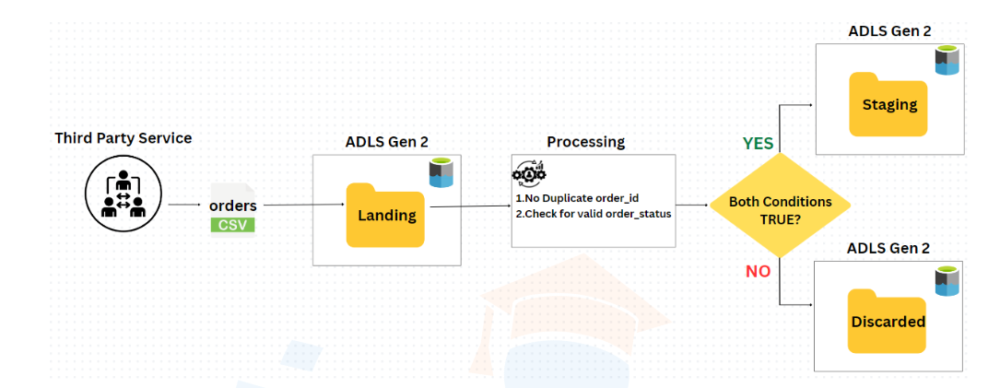
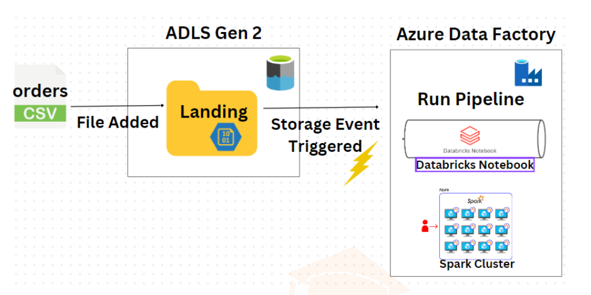
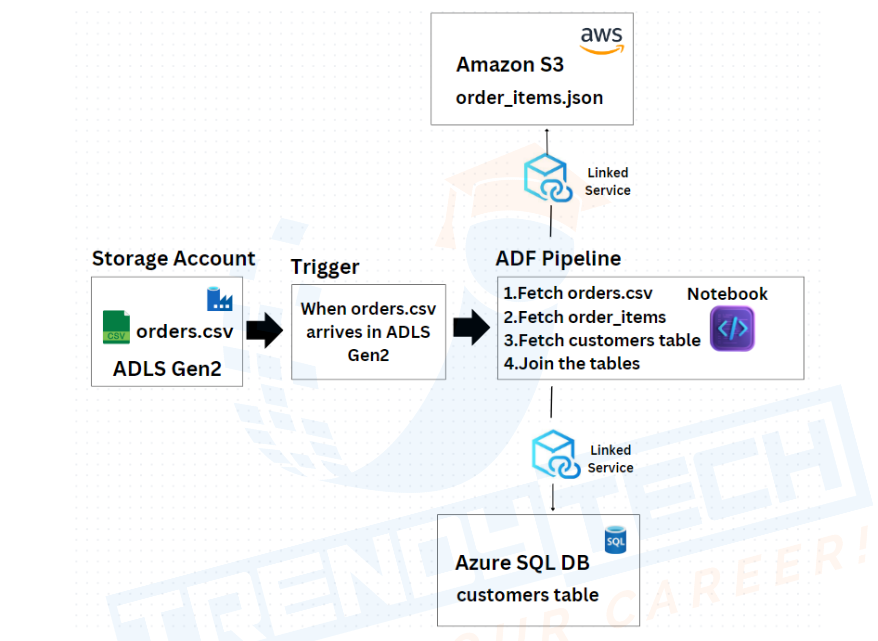

## Automated Data Pipeline for Order Processing and Customer Insights

### Objective:
To develop a robust and scalable data pipeline that automates the processing of order files received from a third-party service, ensuring data integrity and compliance with dynamic validation rules, while securely managing resources and facilitating insightful customer analytics.

### Project Description:
This project focuses on the creation of an automated data pipeline that processes order files as soon as they are received in a landing folder. The pipeline performs critical data validation checks, and based on the results, it categorizes the files into staging or discarded folders. The solution leverages Azure Data Factory for orchestration, Databricks for data processing, and Azure SQL Database for maintaining dynamic validation rules.

### Key Features and Highlights:
- Automated Triggering: The pipeline is automatically triggered upon the arrival of a new file in the storage account.
- Data Validation: Implementation of checks for duplicate order_id and valid order_status using a lookup table in Azure SQL Database.
- Dynamic Validation Rules: Capability to dynamically incorporate changes in the list of valid order_status.
- Secure Resource Management: Utilization of Azure Key Vault for secure storage and access of sensitive information.
- Parameterized File Processing: Generalized approach for dynamically reading and processing files without hardcoding specific filenames.
- Efficient Storage Management: Generic mount code ensuring efficient mounting of storage only when necessary.
- Customer Analytics: Aggregation of data from multiple sources to provide insights into the number of orders placed and the amount spent by each customer.

### Technologies Used:
- Storage: Azure Data Lake Storage Gen2 (ADLS Gen2) with hierarchical namespace.
- Compute: Azure Databricks for executing Spark code.
- Orchestration: Azure Data Factory.
- Security: Azure Key Vault for managing passwords and secret keys.
- Database: Azure SQL Database for maintaining lookup tables.

### Target Audience:
- Business Analysts: To gain insights into customer purchasing behavior.
- Data Engineers: To ensure robust and scalable data processing.
- IT Administrators: To manage secure access and resource utilization.
- Third-Party Data Providers: To integrate seamlessly with the pipeline.

### Role:

I was responsible for designing and implementing the entire data pipeline. This included setting up the storage account, creating and managing Azure Data Factory pipelines, developing Databricks notebooks for data validation, and ensuring secure access to resources using Azure Key Vault.

### Goals and Outcomes:
- Automation: Achieved complete automation of the order file processing workflow.
- Data Integrity: Ensured high data integrity by performing essential validation checks.
- Scalability: Built a scalable solution capable of handling dynamic validation rules and increasing data volume.
- Customer Insights: Provided valuable insights into customer behavior by joining and analyzing data from various sources.

#### This project demonstrates my ability to design and implement complex data pipelines that ensure data integrity, security, and scalability while delivering actionable business insights.